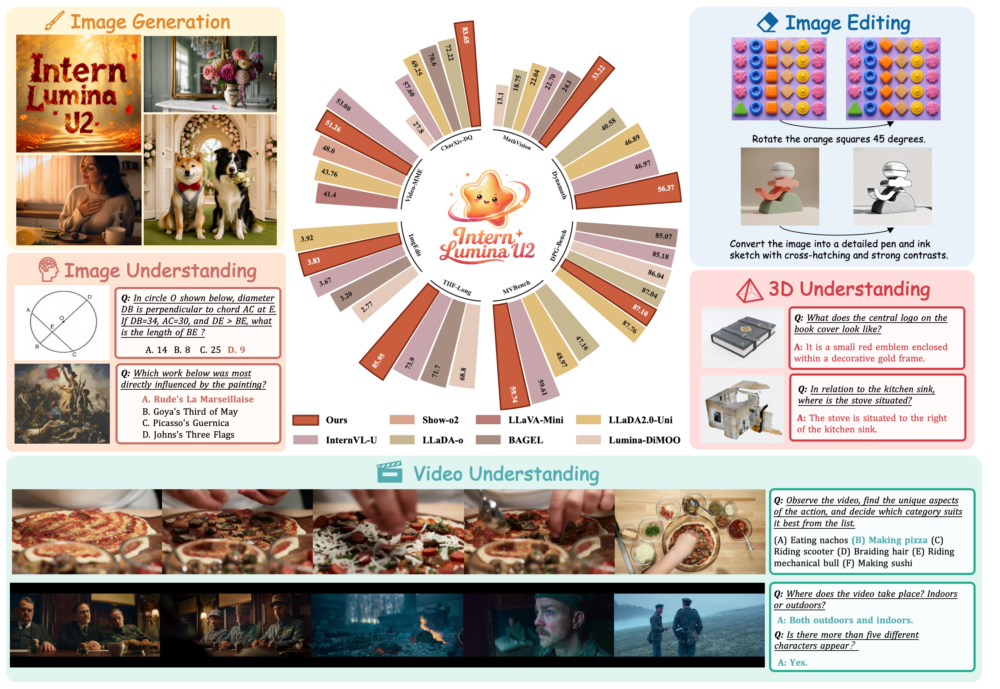
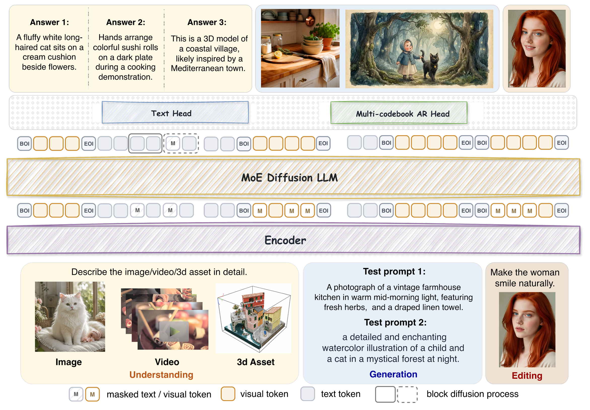
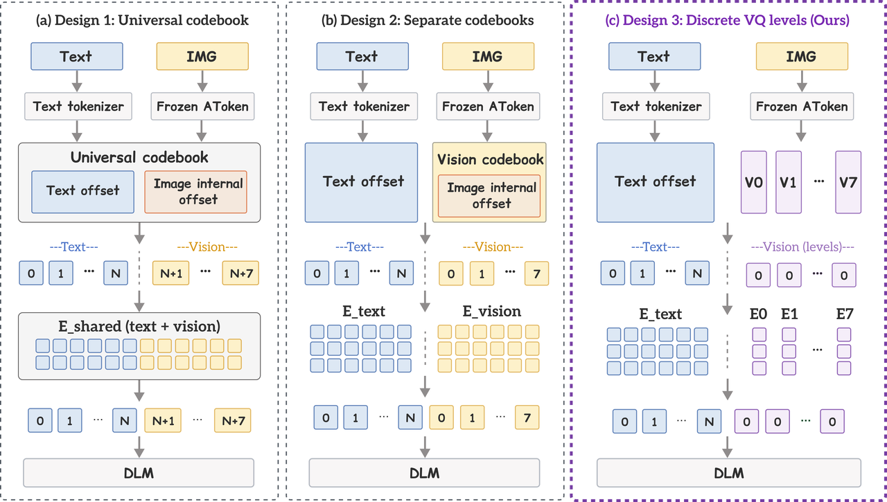
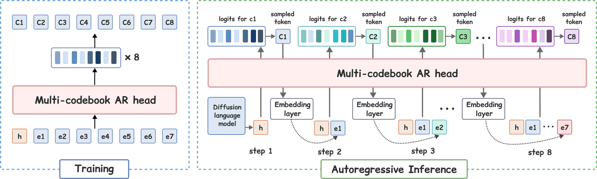

<div align="center">

# Intern Lumina U2: A Multi-Codebook Diffusion Large Language Model for Omni-Visual Understanding, Image Generation and Editing

*Shanghai AI Laboratory*

[[📑 Technical Report (Coming Soon)](#)] &emsp; [[🌐 Project Page](https://internlm.github.io/InternLumina-U2/)] &emsp; [[🤗 Model](https://huggingface.co/internlm/InternLumina-U2)]

[English](./README.md) | [简体中文](./README_zh-CN.md)

</div>



## 📰 News

- **[2026-08]** 🚀 We release the inference code (this repository). Model weights, the training code and the tech report are coming soon — see the [Roadmap](#-roadmap).

## 🌟 Introduction

Intern Lumina U2 is a unified multimodal model that brings language, image, video and 3D into a single framework, covering **text QA, text-to-image generation, image understanding, image editing, video understanding and 3D understanding** with one model. It is a **16B-parameter MoE with 1B active parameters (16B-A1B)**, pairing an efficient sparse backbone with an **8-codebook fully-discrete visual representation** built on [AToken](https://github.com/apple/ml-atoken).

Discrete unified models (e.g. MMaDA, Lumina-DiMOO) showed that once language and vision share a discrete token interface, understanding and generation no longer need separate model stacks. But going from *"can be unified"* to *"high-performance unified"* has been blocked by how visual content is represented and predicted: a single codebook caps the information a visual token can carry, while discrete–continuous hybrids split understanding and generation across different representations and decoding paths.

Intern Lumina U2 explores a new path: **fully-discrete multi-codebook modeling**.


## ✨ Highlights

**1. One model for omni-visual understanding, image generation and editing.** Text QA, T2I generation, image understanding (VQA / OCR / chart / math reasoning), instruction-based image editing, video understanding and 3D understanding all run through the same backbone and the same discrete token interface.



**2. Multi-codebook visual representation.** The [AToken](https://github.com/apple/ml-atoken) tokenizer describes each visual position with **8 complementary codebooks**, expanding the encoding space and preserving local texture, embedded text, geometry and high-frequency detail — without inflating sequence length. On the **input side**, each codebook keeps its own embedding; the 8 per-position embeddings are concatenated and projected into a single backbone token. On the **output side**, prediction is *spatially parallel, codebook-depth autoregressive*: the dLLM backbone denoises many masked spatial positions in parallel, and a multi-codebook AR head predicts the 8 codes of each position in codebook order.


<p align="center"><em>(a) Input-side design: per-codebook embeddings are concatenated and projected into one backbone token.</em></p>


<p align="center"><em>(b) Output-side design: spatially parallel denoising with a codebook-depth autoregressive head.</em></p>

**3. Architecture built on LLaDA-2.0 MoE.** The language backbone is the LLaDA-2.0 MoE diffusion language model(16B-A1B). Its block-diffusion objective, sparse-expert capacity and language competence are extended to unified visual tasks through joint multi-task training.

**4. Dual hardware ecosystems.** Intern Lumina U2 is adapted to both **NVIDIA GPUs and Huawei Ascend NPUs** across training, evaluation and inference, with operator-level numerical alignment between the two backends and an end-to-end pipeline that switches smoothly between them. On Ascend, systematic optimization — fused operators (e.g. FLA and GMM) that relieve the memory-access and kernel-launch bottlenecks of the sparse MoE architecture and long-sequence training, HSDP sharding tuned to balance communication cost against memory footprint, and gradient checkpointing to raise the maximum per-device sequence length — improves training efficiency on a thousand-card Ascend cluster by **1.85x**.

## 🏆 Benchmarks

| Category | Benchmark | Score |
|---|---|---|
| Chart / document understanding | ChartQA | 86.52 |
| | CharXiv-DQ | 83.65 |
| Visual math reasoning | MathVision | 33.22 |
| | DynaMath | 56.37 |
| Hallucination robustness | HallusionBench | 62.15 |
| Video understanding | VideoMME | 51.26 |
| | MVBench | 59.74 |
| 3D understanding | 3D MM-Vet | 41.8 |
| Text-to-image | TIIF-Bench (Short/Long) | 84.60/85.95 |
| | DPG-Bench | 87.10 |
| Image editing | ImgEdit | 3.83 |

Intern Lumina U2 surpasses unified models such as InternVL-U, LLaDA2.0-Uni, Show-o2 and Lumina-DiMOO on fine-grained understanding and generation benchmarks, and outperforms the understanding-only InternVL3-8B on MathVision and DynaMath. See the upcoming tech report for full comparison tables.

## 📦 Release Scope

> **This repository contains the inference code only.** Model weights and the training code (a separate repository), the Ascend stack and the tech report will be released subsequently — see the [Roadmap](#-roadmap).

## 🛠️ Installation

Tested environment: **Python 3.11, PyTorch 2.6.0 + CUDA 12.4, flash-attn 2.7.2**. The LLM loader pins the backbone to PyTorch SDPA, but the AToken visual tokenizer requires FlashAttention.

```bash
# From your local repository checkout:
cd InternLumina-U2

# 0) Create the environment
conda create -n intern-lumina-u2 python=3.11 -y
conda activate intern-lumina-u2

# 1) PyTorch (CUDA 12.4 build) — install BEFORE the rest
pip install torch==2.6.0 torchvision==0.21.0 --index-url https://download.pytorch.org/whl/cu124

# 2) Project dependencies (pinned to our tested versions)
pip install -r requirements.txt

# 3) flash-attn — required by the AToken visual tokenizer (needs the CUDA toolchain;
#    built against the torch above)
pip install flash-attn==2.7.2.post1 --no-build-isolation

# 4) VeOmni (vendored from upstream @600fe6d with the local compatibility patches
#    used by this model). Use --no-deps: requirements.txt is the source of truth.
pip install -e VeOmni/ --no-deps
```

Notes:

- Importing the model code requires a visible GPU (attention/MoE kernels initialize at import time), so run everything on a GPU machine.
- `liger-kernel` and `xformers` are **not** required. The LLM backbone runs on PyTorch SDPA; `flash-attn` is needed only by the AToken visual tokenizer (i.e. every task that encodes or decodes images/video/3D — plain text generation works without it).
- Object-storage packages (`petrel-oss-sdk` / `boto3`) are **optional** — local token files need neither.
- Precomputed `.pkl`/`.pt` token files are deserialized with PyTorch's trusted-payload mode for legacy NumPy payloads; load only files from a trusted source. To create such files yourself, see [Tokenizer Utilities](#-tokenizer-utilities).
- The root driver is intentionally single-process (`INFER_NPROC_PER_NODE=1`); run one request per process. It does not partition a batch across GPUs.
- The root driver changes into the repository root before launching Python, so relative checkpoint, asset, token, and output paths are resolved relative to that root. Set `LUMINA_ROOT=/path/to/InternLumina-U2` when invoking the driver from another directory; direct Python entrypoints should receive absolute paths or be run from the repository root.
- `trimesh` is installed by `requirements.txt` because the bundled GLB/GLTF encoder and the mesh fallback need it. `plyfile` and `diff-gaussian-rasterization` are optional extensions for external Gaussian-splat assets.

## 🎨 Inference

All inference goes through one driver (`infer_1024_sft.sh`) with one section per task. It expects a **split** HF checkpoint directory (`.../hf_ckpt_split`; weights to be released, see Roadmap), and — for anything that encodes or decodes images — the AToken tokenizer weights at `atoken_inference/checkpoints/atoken-sod.pt` (or `ATOKEN_MODEL_PATH=...`). The model asset directory must keep `config.json`, `configuration_internluminau2.py`, `modeling_internluminau2.py`, and `tokenbridge.py` together when using Transformers `AutoModel*`. The system prompt is part of the checkpoint's training contract: for strict reproduction, override the corresponding `*_SYSTEM_PROMPT` variable with the exact prompt used to train that checkpoint. Existing outputs are overwritten by default; pass `--skip_existing` to a Python entrypoint only when the full request is unchanged.

The underlying Python entrypoints (`infer_t2i_sft.py`, `infer_mmu_sft.py`, `infer_video_sft.py`, `infer_3d_sft.py`) can also be called directly; run any of them with `--help`. The model's low-level `generate` is a block-diffusion API, so use these task entrypoints instead of the standard Transformers `generate(max_length=...)` interface.

### 1. Text Generation

```bash
SECTION=text TEXT_PROMPT="Explain why the sky appears blue in a few sentences." \
  CHECKPOINT=/path/to/hf_ckpt_split bash infer_1024_sft.sh
```

### 2. Text-to-Image Generation

`T2I_SIZE` (HxW, default 1024x1024), `T2I_CFG` (3.0), `T2I_TEMP` (1.0), `T2I_TIMESTEPS` (96).

```bash
SECTION=t2i T2I_PROMPT="A serene mountain landscape with towering snow-capped peaks, a crystal-clear blue lake reflecting the mountains, dense pine forests, and a vibrant orange sunrise illuminating the sky." \
  T2I_SIZE=1024x1024 T2I_CFG=3.0 T2I_TIMESTEPS=96 \
  CHECKPOINT=/path/to/hf_ckpt_split bash infer_1024_sft.sh
```

### 3. Image Understanding

`UNDER_MAX_EDGE` caps the encode resolution (default 512); leave `UNDER_PROMPT` unset for captioning; omit `UNDER_IMAGE` to run the shipped demo images. Decode knobs: `UNDER_GEN_LEN` (4096), `UNDER_BLOCK_LEN` (32), `UNDER_TIMESTEPS` (32).

Natural image (VQA / captioning):

```bash
SECTION=under UNDER_IMAGE=imgs/natural.jpg \
  UNDER_PROMPT="Could you provide a caption that neatly summarizes the image without losing focus on the important visuals?" \
  UNDER_MAX_EDGE=512 UNDER_GEN_LEN=4096 UNDER_TIMESTEPS=32 \
  CHECKPOINT=... bash infer_1024_sft.sh
```

Chart / table / document QA (same entrypoint, denser input):

```bash
SECTION=under UNDER_IMAGE=imgs/graph.png \
  UNDER_PROMPT="Is this a chart or a table? Reproduce it in Markdown and summarize what it shows." \
  CHECKPOINT=... bash infer_1024_sft.sh
```

### 4. Image Editing

The raw source image is encoded on the fly; defaults run the shipped sample (`imgs/edit_source.png` + a charcoal-sketch instruction). `EDIT_MAX_EDGE` caps the encode resolution; `EDIT_CFG` (1), `EDIT_TIMESTEPS` (64).

```bash
SECTION=edit EDIT_IMAGE=imgs/edit_source.png \
  EDIT_INSTRUCTION="Convert the scene to a charcoal sketch style." \
  EDIT_MAX_EDGE=512 EDIT_TIMESTEPS=64 EDIT_CFG=1 \
  CHECKPOINT=... bash infer_1024_sft.sh
```

For dual CFG, set both variables together (and omit `EDIT_CFG`): `EDIT_CFG_TEXT=0.5 EDIT_CFG_IMG=0.5`.

### 5. Video Understanding

Defaults run the shipped sample clip (`imgs/demo_video.mp4`); `VIDEO_PROMPT` sets your question. `VIDEO_NUM_FRAMES` (64 sampled frames), `VIDEO_MAX_SIZE` (448 long-edge per frame), `VIDEO_GEN_LEN` (1024), `VIDEO_BLOCK_LEN` (32), `VIDEO_TIMESTEPS` (32).

```bash
SECTION=video VIDEO_PATH=imgs/demo_video.mp4 \
  VIDEO_PROMPT="Describe this video in detail from start to finish." \
  VIDEO_NUM_FRAMES=64 VIDEO_MAX_SIZE=448 \
  CHECKPOINT=... bash infer_1024_sft.sh
```

### 6. 3D Understanding

Defaults run the shipped sample asset (`imgs/demo_3d.glb`); `PROMPT_3D` sets your question. Decode knobs: `GEN_LEN_3D` (128), `BLOCK_LEN_3D` (32), `TIMESTEPS_3D` (32).

GLB/GLTF understanding encodes the asset exactly as in training — the bundled `atoken_inference/glb_encode` module drives [Blender](https://www.blender.org/) to render 64 color/depth views, back-projects them into a voxel grid, and feeds AToken. Install Blender once — `infer_3d_sft.py` then finds it automatically:

```bash
bash tools/setup_blender.sh   # downloads Blender 4.5 into third_party/
```

A Blender already on `PATH` or pointed to by `BLENDER_BIN` also works. On minimal containers a few X/GL system libraries may be missing; the setup script verifies headless startup and prints the exact `apt-get` line (or set `BLENDER_LIB_DIR` to a directory of the missing `.so` files if you cannot install system packages). Precomputed 3D tokens (`--token_path`) skip encoding entirely and never need Blender.

```bash
SECTION=3d ASSET_3D=imgs/demo_3d.glb \
  PROMPT_3D="Describe this 3D object in detail." \
  CHECKPOINT=... bash infer_1024_sft.sh
```

## 🧰 Tokenizer Utilities

`tools/tokenize_image.py` pre-encodes images into the token files the inference entrypoints accept (`--input_token_paths` for editing, `--token_path` for understanding) — useful to encode once and reuse across runs, or to inspect what the model actually "sees":

```bash
# Encode an image (writes tokens/<stem>.pkl: {indices [N,8], coords [N,5]})
python tools/tokenize_image.py --image imgs/edit_source.png --output_dir tokens/

# Encode a whole folder at 512 long-edge, plus original|reconstruction previews
# to visually verify the round trip
python tools/tokenize_image.py --image path/to/folder --max_edge 512 \
    --reconstruct --output_dir tokens/
```

For 3D assets the equivalent offline encoder is `atoken_inference/glb_encode/encode_glb_tokens.py` (`--glb ... --output ...`; requires Blender, see the 3D note above).

## 🗺️ Roadmap

- [x] Inference code for T2I / editing / image, video and 3D understanding
- [ ] Model weights
- [ ] Training code 
- [ ] Ascend NPU training & inference stack
- [ ] Tech report

## 🙏 Acknowledgements

This project builds on the excellent work of:


- [LLaDA-2.0](https://github.com/inclusionAI/LLaDA2.0-Uni) — the MoE diffusion language model backbone.
- [AToken (Apple ml-atoken)](https://github.com/apple/ml-atoken) — the multi-codebook visual tokenizer used for all visual modalities; `atoken_inference/` is derived from it.
- [Lumina-DiMOO](https://github.com/Alpha-VLLM/Lumina-DiMOO)  & [LLaDA2.0-Uni](https://github.com/inclusionAI/LLaDA2.0-Uni) — pioneering discrete-diffusion unified modeling.
- [VeOmni](https://github.com/ByteDance-Seed/VeOmni) — vendored from upstream commit `600fe6d` with local compatibility patches for this model.

## 📜 License

This project is released under the [Apache License 2.0](LICENSE). The bundled `VeOmni/` directory retains its upstream Apache-2.0 license. `atoken_inference/` is derived from Apple's [ml-atoken](https://github.com/apple/ml-atoken) and is redistributed under Apple's original license terms ([atoken_inference/LICENSE](atoken_inference/LICENSE)).

## 📖 Citation

```bibtex
@misc{internluminau2,
  title  = {Intern Lumina U2},
  author = {{Intern Lumina U2 Team, Shanghai AI Laboratory}},
  year   = {2026},
  note   = {Tech report coming soon}
}
```
